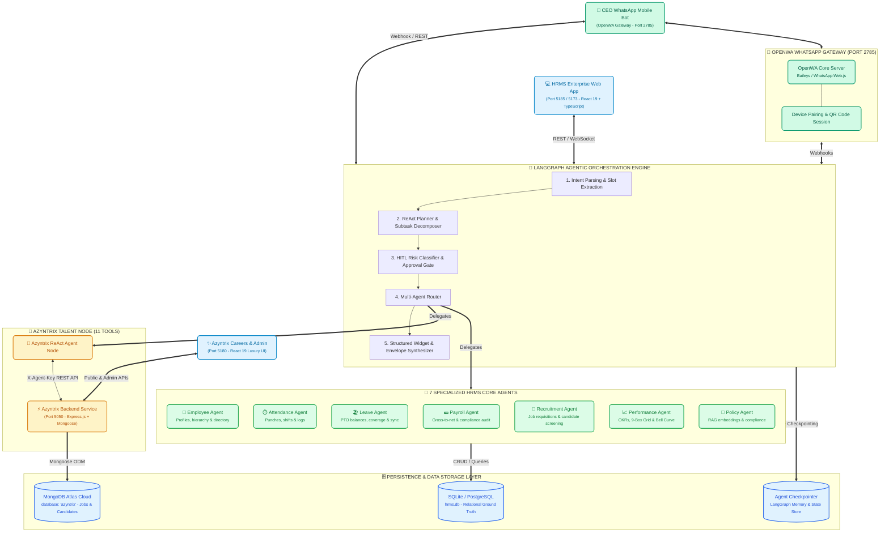

# 🚀 Autonomous Multi-Agent HRMS & Azyntrix Talent Platform

> **Enterprise-grade Autonomous Human Resource Management System & AI Talent Suite powered by LangGraph Multi-Agent Orchestration, 7 Specialized HR Core Agents, Azyntrix AI Recruitment ReAct Node, MongoDB Atlas Cloud Persistence, and OpenWA WhatsApp Executive Gateway with Human-in-the-Loop (HITL) Approval Gates.**

---

## 🏛️ System Architecture

The platform operates as an integrated multi-tier agentic ecosystem connecting **FastAPI & LangGraph**, **Azyntrix Talent Suite**, **OpenWA WhatsApp Executive Channel**, and **Relational + NoSQL Storage**:



---

## 🌟 Key Platform Capabilities

### 1. 🤖 Multi-Agent Orchestration & Azyntrix ReAct Node
- **11 Integrated Azyntrix Tools**: Complete programmatic control over job openings, application status workflows, AI candidate scoring, interview question generation, analytics, and audit logging.
- **Dynamic Routing**: Automatic intent routing between local HR relational records and external live recruitment pipelines.
- **Deterministic Tool Invocation**: Async LangChain tools executed reliably across streaming agent loops.

### 2. 📲 CEO Autonomous WhatsApp Orchestrator (via OpenWA)
- **Direct Terminal & Dashboard QR Code**: Instant device pairing via OpenWA API gateway without cloud webhooks.
- **Autonomous Morning Briefings**: Automated daily executive summaries covering company headcount, attendance percentages, active leave counts, and open candidate pipelines.
- **Interactive Job Requisition Approvals**: Real-time WhatsApp conversational workflow where the CEO can create, review, refine, and approve live job postings directly from chat.

### 3. 🎯 Performance & Appraisal System
- **9-Box Talent Grid**: Real-time matrix plotting performance versus potential.
- **Bell Curve Calibration**: Visual distribution charts benchmarking company performance ratings against target standard curves.
- **Interactive OKR Tracking**: Departmental and individual objective milestone progress.

### 4. 🔒 Enterprise Security & Human-in-the-Loop (HITL)
- **14 Critical Action Gates**: Deletions, status changes, salary disbursements, and external JD postings automatically pause for explicit human confirmation.
- **Sliding-Window Rate Limiter**: 120 req/min IP-level rate limiting on agent endpoints.
- **Real-time Audit Trail**: Structured logging of all AI agent tool executions with timestamped attribution.

---

## 🛠️ Port & Service Mapping

| Service / App | Directory | Default URL / Port | Technology Stack |
|---|---|---|---|
| **HRMS FastAPI Gateway** | `backend/` | `http://localhost:8000` | Python 3.11+, FastAPI, LangGraph, Pydantic |
| **HRMS Web Workspace** | `frontend/` | `http://localhost:5185` (or `5173`) | React 19, TypeScript, TailwindCSS, Lucide |
| **Azyntrix Backend API** | `azyntrix/backend/` | `http://localhost:5050` | Node.js, Express.js, Mongoose, MongoDB Atlas |
| **Azyntrix Career & Admin**| `azyntrix/` | `http://localhost:5180` | React 19, TypeScript, TailwindCSS, Lucide |
| **OpenWA WhatsApp Gateway** | `openwa_gateway/` | `http://localhost:2785` | NestJS, Baileys / Puppeteer, SQLite |

> **🔐 Default Admin Passcode for Azyntrix Dashboard (`http://localhost:5180/admin`)**:  
> `azyntrix-admin-2026`

---

## 🚀 Setup & Installation Guide

### Prerequisites
- **Python**: `3.11+` (Virtual environment in `./.venv`)
- **Node.js**: `20.x` or `22.x`
- **Git**: Installed and accessible in PATH

---

### Step 1: Environment Variables (`.env`)
Create a `.env` file in the project root:

```env
# --- LLM API Keys ---
GROQ_API_KEY=your_groq_api_key_here
GEMINI_API_KEY=your_gemini_api_key_here
MISTRAL_API_KEY=your_mistral_api_key_here

# --- Azyntrix Backend Connection ---
AZYNTRIX_API_URL=http://localhost:5050
AZYNTRIX_API_KEY=azyntrix-agent-dev-key-2026
MONGODB_URI=mongodb+srv://<username>:<password>@cluster0.mongodb.net/azyntrix?retryWrites=true&w=majority

# --- OpenWA WhatsApp Gateway ---
OPENWA_API_URL=http://localhost:2785
OPENWA_API_KEY=
OPENWA_SESSION_ID=default
OPENWA_WEBHOOK_SECRET=your_webhook_secret_here
CEO_PHONE_NUMBER=919876543210
```

---

### Step 2: Python Backend Setup (HRMS & Agents)
```bash
# 1. Activate Python virtual environment (strictly use .venv)
.\.venv\Scripts\activate      # Windows PowerShell
# source .venv/bin/activate  # Linux/macOS

# 2. Install dependencies (if needed)
pip install fastapi uvicorn pydantic aiosqlite httpx python-dotenv tenacity langchain langgraph

# 3. Start the FastAPI Multi-Agent Server
python -m uvicorn backend.app:app --host 0.0.0.0 --port 8000 --reload
```
* API Documentation & Swagger: **`http://localhost:8000/docs`**

---

### Step 3: HRMS Frontend Setup
```bash
# 1. Navigate to frontend folder
cd frontend

# 2. Install packages & run
npm install
npm run dev -- --port 5185
```
* HRMS Enterprise Platform: **`http://localhost:5185`**
* AI Multi-Agent Studio: **`http://localhost:5185/ai`**
* Performance & Bell Curve: **`http://localhost:5185/performance`**

---

### Step 4: Azyntrix Talent Suite Setup
```bash
# Terminal 1: Azyntrix Node.js Backend
cd azyntrix/backend
npm install
node server.mjs

# Terminal 2: Azyntrix Career Portal & Admin UI
cd azyntrix
npm install
npm run dev -- --port 5180
```
* Public Careers Board: **`http://localhost:5180/careers`**
* Admin Kanban & Analytics: **`http://localhost:5180/admin`** *(Passcode: `azyntrix-admin-2026`)*

---

### Step 5: OpenWA WhatsApp Gateway Setup & Device Pairing
```bash
# 1. Navigate to OpenWA directory
cd openwa_gateway

# 2. Install dependencies
npm install

# 3. Start OpenWA Server
npm run start:dev
```
* **QR Code Pairing**:
  1. Look at your terminal output or open the OpenWA Dashboard at **`http://localhost:2785`**.
  2. Open WhatsApp on your phone > **Settings** > **Linked Devices** > **Link a Device**.
  3. Scan the terminal ASCII QR code or the dashboard QR code.
  4. Once authenticated, the CEO WhatsApp loop will automatically handle incoming messages and push real-time HR briefings.

---

## 🧩 Autonomous Agent Tool Registry

| Domain | Tool Name | Description |
|---|---|---|
| **Core HR** | `get_total_employee_count` | Retrieves active, on-leave, and total employee headcount. |
| **Core HR** | `get_headcount_by_department` | Returns departmental breakdown of workforce distribution. |
| **Core HR** | `get_today_attendance_summary` | Calculates real-time present, late, and absent metrics. |
| **Azyntrix**| `search_azyntrix_jobs` | Filters and searches active recruitment postings. |
| **Azyntrix**| `post_azyntrix_job` | Creates new job requisitions in MongoDB Atlas. |
| **Azyntrix**| `update_azyntrix_job_status` | Transitions job postings (`draft`, `published`, `archived`). |
| **Azyntrix**| `get_azyntrix_job_applications` | Fetches candidate applicants across pipeline stages. |
| **Azyntrix**| `update_azyntrix_application_status` | Advances candidates (`applied`, `reviewing`, `interview`, `offered`). |
| **Azyntrix**| `score_and_rank_candidates` | Uses AI reasoning to rank resumes against job requirements. |
| **Azyntrix**| `generate_ai_interview_questions` | Synthesizes tailored technical & behavioral interview rubrics. |
| **Azyntrix**| `get_azyntrix_analytics` | Aggregates application counts, hiring velocity, and stage funnels. |
| **Azyntrix**| `azyntrix_audit_logs` | Provides compliance and audit traces of all agent mutations. |

---

## 🛡️ Human-in-the-Loop (HITL) Workflow

```text
User Request ("Post a new Senior AI Architect JD on Azyntrix")
     ↓
Intent Classifier & ReAct Node
     ↓
Agent drafts opening details (v1)
     ↓
PAUSES ON APPROVAL GATE: WAITING_FOR_APPROVAL
     ↓
┌────────────────────────────────────────────────────────┐
│ [ Request Changes ]                  [ Confirm & Post ] │
└────────────────────────────────────────────────────────┘
       │                                     │
       ├── If "Request Changes"              └── If "Approve"
       │      ↓                                     ↓
       │   Agent updates draft to (v2)       State = COMPLETED
       │      ↓                                     ↓
       │   Pauses again for verification     MongoDB Atlas Mutation
       │                                            ↓
       │                                     Returns Live URL
```

---

## 📄 License & Attribution
- Built with **FastAPI**, **LangGraph**, **React 19**, **OpenWA**, and **MongoDB Atlas**.
- Open source under the **MIT License**.
