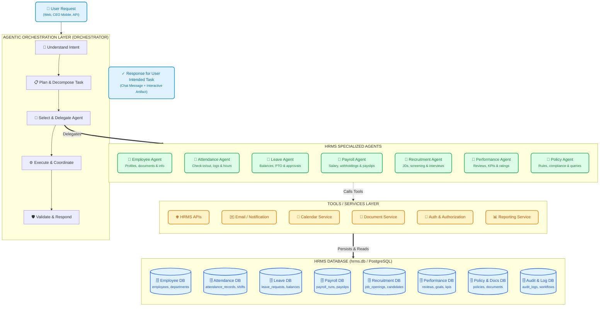

# Autonomous Agentic HRMS Platform

> **Enterprise-grade Autonomous Human Resource Management System powered by an Agentic Orchestration Layer, 7 Specialized Domain Agents, Shared Engine Sub-services, and Real Relational Persistence with Human-in-the-Loop Approval Gates.**

---

## 🏛️ System Architecture

The platform operates as a multi-tier agentic architecture where a central **Agentic Orchestration Layer** coordinates **7 Specialized Domain Agents**, executes operations through a **Tools & Services Layer**, and manages state across **real relational database tables**.



---

## ⚡ Agentic Orchestration Layer — Technical Flow (Behind The Scenes)

The Orchestration Layer is the brain of the system: it understands, plans, decides, coordinates, and validates all actions before closing the loop.

```mermaid
flowchart LR
    subgraph STAGES ["AGENTIC ORCHESTRATION LAYER — 7 TECHNICAL STAGES"]
        direction LR
        S1["<b>STEP 1</b><br/><b>Receive & Capture</b><br/>• FastAPI (API Layer)<br/>• WebSocket (Real-time)<br/>• Pydantic (Request Model)<br/>• Python"]
        S2["<b>STEP 2</b><br/><b>Understand Intent (NLU)</b><br/>• LLaMA 3 / Mistral / Groq<br/>• LangChain (LLM Call)<br/>• Pydantic (Schema)<br/>• Python"]
        S3["<b>STEP 3</b><br/><b>Plan & Decompose Task</b><br/>• LangChain (Planning)<br/>• LangGraph (Planner)<br/>• Subtask Sequencing<br/>• Python"]
        S4["<b>STEP 4</b><br/><b>Decide & Select Action</b><br/>• LangGraph (Routing)<br/>• Business Rules Checks<br/>• State Tracking<br/>• Pydantic Validation"]
        S5["<b>STEP 5</b><br/><b>Execute via Tools/APIs</b><br/>• FastAPI (Backend APIs)<br/>• Requests / HTTPX<br/>• Read/Write Database<br/>• SQLite (Local DB)"]
        S6["<b>STEP 6</b><br/><b>Validate & Update State</b><br/>• Pydantic (Validation)<br/>• Business Rule Checks<br/>• Data Consistency<br/>• SQLite (State Store)"]
        S7["<b>STEP 7</b><br/><b>Generate & Close Loop</b><br/>• LLaMA 3 (via Ollama/Groq)<br/>• LangChain (Response)<br/>• Approval Gate<br/>• Session Update"]

        S1 --> S2 --> S3 --> S4 --> S5 --> S6 --> S7
    end

    subgraph SHARED ["SHARED COMPONENTS INSIDE ORCHESTRATOR"]
        direction TB
        C1["🗂️ <b>Context Manager</b><br/>Maintains conversation history, user info & session data<br/><i>(SQLite Session Store, Python)</i>"]
        C2["🔄 <b>State Manager</b><br/>Tracks current step, plan progress, retries & workflow state<br/><i>(LangGraph State, SQLite, Python)</i>"]
        C3["🧠 <b>Memory</b><br/>Short-term conversation memory & long-term factual memory<br/><i>(LangChain Memory, SQLite / Local DB)</i>"]
        C4["🧰 <b>Tool Registry</b><br/>Catalog of available tools/APIs with schemas and usage<br/><i>(Python Tool Registry, Pydantic Schema)</i>"]
        C5["🛡️ <b>Guardrails & Rule Engine</b><br/>Applies business rules, access control, privacy & safety<br/><i>(Python Custom Logic, Pydantic Validation)</i>"]
        C6["🔁 <b>Error Handler & Retry</b><br/>Handles errors, retries failed actions, ensures flow integrity<br/><i>(Tenacity Retry Library, Python Logging)</i>"]
    end

    SHARED -.-> STAGES
```



---

## 🤖 The 7 Specialized HRMS Agents

| # | Agent | Real Core Responsibility | Database Entities Managed |
|---|---|---|---|
| **1** | **Employee Agent** | Manages employee master directory, onboardings, document uploads, personal records, and reporting hierarchies. | `employees`, `departments`, `designations`, `employee_documents` |
| **2** | **Attendance Agent** | Real-time punch clock-in/out, biometric integration, shift schedules, overtime calculation, and attendance analytics. | `attendance_records`, `shifts`, `work_schedules`, `timesheets` |
| **3** | **Leave Agent** | Tracks leave accruals, PTO balances, manager approvals, calendar sync, and team coverage risk assessment. | `leave_requests`, `leave_types`, `holidays` |
| **4** | **Payroll Agent** | Automated gross-to-net calculation, tax withholdings, statutory deductions, compliance audit, and payslip generation. | `payroll_runs`, `payslips`, `salary_structures`, `salary_components` |
| **5** | **Recruitment Agent** | Job requisition drafting, career board publishing, candidate resume screening, ranking, and interview scheduling. | `job_openings`, `candidates`, `candidate_applications`, `interviews`, `offers` |
| **6** | **Performance Agent** | 360-degree reviews, quarterly OKRs, KPI metrics, promotion proposals, and performance analytics. | `performance_reviews`, `kpis`, `milestones`, `tasks` |
| **7** | **Policy Agent** | Instant semantic question-answering over company employee handbooks, compliance policies, and labor laws using RAG. | `policies`, `documents`, `vector_store`, `audit_logs` |

---

## 🛠️ Free & Open-Source Tech Stack

| Component | Technology | Purpose |
|---|---|---|
| **Core Language** | Python 3.11+ | High-performance asynchronous backend services |
| **LLM Inference** | LLaMA 3 (via Ollama / Groq) / Mistral | Intent parsing, synthesis, reasoning, planning |
| **LLM Orchestration** | LangChain | Prompt templates, output parsing, tool chaining |
| **Workflow Engine** | LangGraph | State graphs, cyclic transitions, node execution |
| **Backend API Gateway** | FastAPI | High-throughput async REST endpoints & WebSockets |
| **Database & State Store**| SQLite (`hrms.db`) + Supabase | Ground-truth relational entities & multi-channel sync |
| **Data Validation** | Pydantic v2 | Strict schema validation for tools, requests, and artifacts |
| **HTTP Transport** | HTTPX / Requests | Resilient API communication & external integrations |
| **Resilience & Retry** | Tenacity | Exponential backoff, failure recovery, fallback routing |
| **Frontend Platform** | React 19, TypeScript, TailwindCSS | Enterprise workspace, live orchestration visualizer |

---

## 🚀 Setup & Local Development Guide

### 1. Prerequisites
- **Python**: `3.11+`
- **Node.js**: `18.x` or `20.x`
- **SQLite3**: Pre-installed on Windows/macOS/Linux

---

### 2. Backend Setup
```bash
# 1. Navigate to project root
cd "HRMS"

# 2. Activate virtual environment (if present) or create one
python -m venv .venv
.venv\Scripts\activate      # Windows PowerShell/CMD
# source .venv/bin/activate  # Linux/macOS

# 3. Install backend dependencies
pip install fastapi uvicorn pydantic aiosqlite httpx python-dotenv tenacity

# 4. Configure environment (.env)
# Create or edit .env in project root:
GROQ_API_KEY="your-groq-api-key"
MISTRAL_API_KEY="your-mistral-api-key"
SUPABASE_URL="https://your-project.supabase.co"
SUPABASE_SERVICE_ROLE_KEY="your-supabase-service-key"

# 5. Start FastAPI Backend Gateway
python -m uvicorn backend.app:app --host 0.0.0.0 --port 8000 --reload
```
* Backend Swagger UI will be live at: **`http://localhost:8000/docs`**

---

### 3. Frontend Setup
```bash
# 1. Navigate to frontend directory
cd "frontend"

# 2. Install dependencies
npm install

# 3. Start development server
npm run dev
```
* Main Enterprise HRMS Platform: **`http://localhost:5185`**
* Autonomous AI Workspace: **`http://localhost:5185/ai`**
* Live Multi-Agent Orchestration Center: **`http://localhost:5185/orchestration`**
* CEO Executive Mobile Interface: **`http://localhost:5185/ceo-mobile`**
* Employee Self-Service (ESS) Portal: **`http://localhost:5185/employee-portal`**

---

## 📱 Mobile & Local Area Network (LAN) Access

You can open and interact with the **CEO Executive Chat** and the **Employee Self-Service Portal** directly from your smartphone, tablet, or any device on your local Wi-Fi network without requiring third-party tunneling.

### 1. Discover Your Machine's LAN IP
Open PowerShell or Command Prompt and run:
```powershell
ipconfig
```
Locate the **IPv4 Address** under your active Wi-Fi or Ethernet adapter (for example: `192.168.1.4`).

### 2. Access from Any Mobile Browser on Your Wi-Fi
* **CEO Executive Mobile Chat**:
  ```text
  http://<YOUR-LAN-IP>:5185/ceo-mobile
  ```
  *(Example: `http://192.168.1.4:5185/ceo-mobile`)*
* **Employee Self-Service (ESS) Portal**:
  ```text
  http://<YOUR-LAN-IP>:5185/employee-portal
  ```
  *(Example: `http://192.168.1.4:5185/employee-portal`)*

> **Security & Network Note**: Ensure Windows Defender Firewall allows incoming traffic on port `5185` for Private Networks. Both your PC and your phone must be connected to the same Wi-Fi / Local Subnet.

---

## 🧩 Backend-Validated Structured Response Architecture

To eliminate raw, unformatted markdown dumps (such as `### Headcount - **Active**: 11...`) and guarantee high visual fidelity across both Desktop and Mobile devices, the platform implements a **Backend-Validated Hybrid Response Envelope (`ChatResponseEnvelope`)**:

```text
User Request ("What's our current headcount?")
     ↓
Intent Router & Database Facts Engine
     ↓
Domain Agent executes real SQLite read / mutation
     ↓
Backend Widget Factory synthesizes typed domain data
     ↓
Pydantic Validation (ChatResponseEnvelope v1)
     ├── Text: Conversational summary
     ├── Widgets: [Typed Widget: HEADCOUNT, ATTENDANCE, etc.]
     └── Actions: [Interactive buttons e.g., 'View Directory']
     ↓
Frontend WidgetRegistry (Desktop & CEO Mobile)
     ├── <HeadcountWidget /> (Interactive progress bars & percentages)
     ├── <AttendanceWidget /> (Presence rates & department breakdown)
     ├── <LeaveBalanceWidget /> (Accrual donut charts & allowances)
     ├── <TaskSprintWidget /> (Active sprint milestones & assignee chips)
     └── <PolicyCardWidget /> (Official compliance docs & citations)
```

### Safety Guarantee:
The LLM is **never** given direct control over raw UI layout code. Instead, the backend orchestration layer extracts verified database facts, constructs strongly-typed Pydantic schemas, and transmits clean payloads that render natively through the frontend `WidgetRegistry`.

---

## 🔒 Human-in-the-Loop (HITL) Workflow Lifecycle

The system **never silently proceeds past high-impact decisions** (e.g., job postings, salary disbursements, offer letters, or leave exceptions).

```text
User Request
     ↓
NLU & Intent Routing
     ↓
Specialized Agent Drafts Artifact (v1)
     ↓
Pauses on State: WAITING_FOR_APPROVAL
     ↓
┌────────────────────────────────────────────────────────┐
│ [ Request Changes ]                  [ Approve ]       │
└────────────────────────────────────────────────────────┘
       │                                     │
       ├── If "Request Changes"              └── If "Approve"
       │      ↓                                     ↓
       │   Ask what to change                State = COMPLETED
       │      ↓                                     ↓
       │   Agent updates to (v2)             Real SQLite Mutation
       │      ↓                                     ↓
       │   Shows revised draft               Next Stage Unlocked:
       │      ↓                              "Approved ✓ Next: Hiring
       │   PAUSES AGAIN                      manager? Start date?..."
```

---

## 📊 Live Verification Status

All 4 operational domains are verified with live SQLite database mutations and multi-agent delegation traces:
- **Recruitment**: `Create a JD for a Junior AI Engineer` -> Persists opening in `job_openings`.
- **Payroll**: `Run autonomous payroll compliance audit across all engineering staff` -> Validates gross-to-net across 48 employees.
- **Offers**: `Prepare offer letter for Alex Rivera as Senior AI Engineer` -> Generates compensation & equity package with digital sign-off gate.
- **Leave**: `Review leave exception for Marcus Vance` -> Evaluates team coverage risk and confirms calendar sync.
