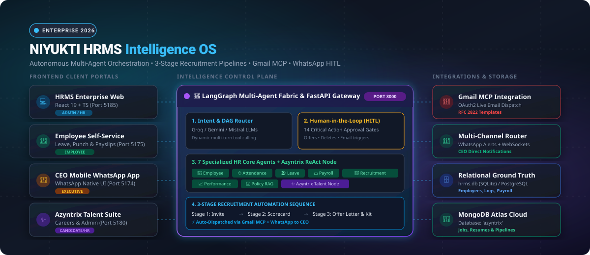
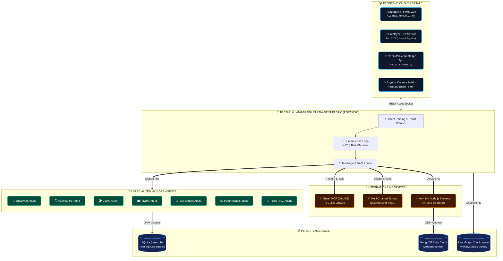
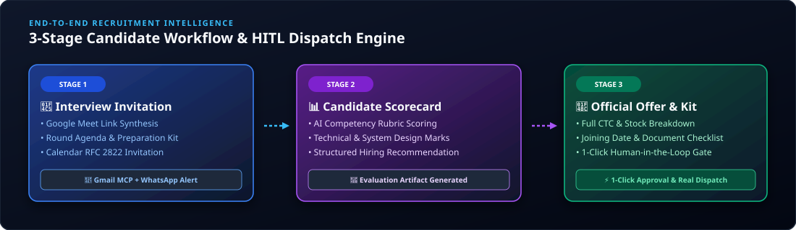

# 🚀 Niyukti HRMS Intelligence OS & AI Talent Suite

<div align="center">



[](https://python.org)
[](https://fastapi.tiangolo.com)
[](https://langchain-ai.github.io/langgraph/)
[](https://react.dev)
[](https://www.typescriptlang.org)
[](https://tailwindcss.com)
[](https://www.mongodb.com)
[](LICENSE)

**An autonomous, enterprise-grade Human Resource Management System & AI Talent Suite powered by LangGraph multi-agent orchestration, 7 specialized HR core agents, Azyntrix recruitment ReAct node, Google Workspace / Gmail MCP, and real-time WhatsApp executive dispatch with Human-in-the-Loop (HITL) safety gates.**

[Quickstart Guide](#-quickstart-guide-step-by-step) • [Environment Setup](#-environment-variables-setup-guide) • [Architecture](#-system-architecture) • [Recruitment Sequence](#-3-stage-candidate-recruitment-pipeline) • [Port Matrix](#-application-port--access-matrix) • [Developer Guide](#-developer-guide--adding-new-features)

</div>

---

## 🌟 Executive Overview

**Niyukti HRMS Intelligence OS** combines deterministic enterprise HR management with state-of-the-art agentic AI workflows. The platform operates across five synchronized client interfaces and a distributed backend fabric:

- 🧠 **LangGraph Multi-Agent Fabric**: Multi-turn ReAct orchestration coordinating 7 specialized Core HR agents (Employee, Attendance, Leave, Payroll, Recruitment, Performance, Policy RAG) and the Azyntrix Talent Node.
- 🎯 **3-Stage Autonomous Candidate Sequence**: Automated interview scheduling with Google Meet links, AI evaluation scorecard generation, and official offer letter generation with vesting schedules.
- 📧 **Google Workspace / Gmail MCP Integration**: Dispatches real RFC 2822 corporate emails with personalized HTML styling directly from authorized OAuth2 credentials.
- 💬 **Multi-Channel Notification Router**: Broadcasts instant WhatsApp alerts to CEO mobile numbers (`+918591133817`, `+919372267957`) and streams live WebSocket events on critical HR actions.
- 🛡️ **Human-in-the-Loop (HITL) Safety Gate**: Enforces explicit 1-click human verification before any destructive action, salary disbursement, or candidate offer dispatch.
- 📊 **Performance & Talent Analytics**: Interactive 9-Box Talent Grid, Bell Curve rating distribution calibration, and departmental OKR tracking.

---

## 🏛️ System Architecture



---

## 🎯 3-Stage Candidate Recruitment Pipeline

<div align="center">



</div>

The platform includes a dedicated **3-Stage Candidate Pipeline Automation Engine** integrated with Google Workspace and WhatsApp:

1. **Stage 1: Interview Invitation (`INTERVIEW_INVITATION`)**
   - Synthesizes interview agendas, technical topics, candidate preparation guides, and Google Meet coordinates.
   - Automatically drafts and previews the calendar invite for HR approval.
2. **Stage 2: Candidate Evaluation Scorecard (`EVALUATION_FEEDBACK`)**
   - AI evaluates candidate interview feedback across domain competencies, system design, and behavioral fitness.
   - Outputs structured scores (e.g. `9.2/10`) with automated hiring recommendations (`Strong Hire`, `Hire`, `Hold`, `Reject`).
3. **Stage 3: Official Offer Letter & Onboarding Kit (`OFFER_LETTER`)**
   - Generates corporate offer letters with fixed/variable CTC breakdowns, equity vesting, joining dates, and document checklists.
   - Pauses on **HITL Approval Gate**; clicking **"Approve & Dispatch via Gmail"** sends the real email from `2000nyrasharma@gmail.com` to candidate (`adarshyt1504@gmail.com`) and fires instant WhatsApp alerts to the CEO.

---

## 📊 Application Port & Access Matrix

| Application / Service | Directory | URL / Port | Technology Stack | Access Role / Credentials |
|:---|:---|:---|:---|:---|
| **HRMS FastAPI Backend** | `backend/` | [`http://localhost:8000`](http://localhost:8000) | Python 3.11+, FastAPI, LangGraph, SQLite | REST API & Swagger ([`/docs`](http://localhost:8000/docs)) |
| **Enterprise HRMS Web** | `frontend/` | [`http://localhost:5185`](http://localhost:5185) | React 19, TypeScript, TailwindCSS, Lucide | HR Manager / Administrator |
| **Employee Self-Service** | `employees/` | [`http://localhost:5175`](http://localhost:5175) | React 19, Vite, TypeScript, TailwindCSS | Employee (`EMP-001` to `EMP-010`) |
| **CEO Mobile WhatsApp App** | `ceo_mobile_chat_app/` | [`http://localhost:5174`](http://localhost:5174) | React 19, Vite, TypeScript, TailwindCSS | Executive Partner / CEO |
| **Azyntrix Careers Board** | `azyntrix/` | [`http://localhost:5180/careers`](http://localhost:5180/careers) | React 19, TypeScript, TailwindCSS | Public Candidates |
| **Azyntrix Admin Kanban** | `azyntrix/` | [`http://localhost:5180/admin`](http://localhost:5180/admin) | React 19, TypeScript, TailwindCSS | Passcode: **`azyntrix-admin-2026`** |
| **Azyntrix Express Backend** | `azyntrix/backend/` | [`http://localhost:5050`](http://localhost:5050) | Node.js, Express.js, Mongoose, MongoDB | API Key: `azyntrix-agent-dev-key-2026` |

---

## 📁 Repository Directory Structure

```text
HRMS/
├── backend/                        # Python FastAPI Backend & Agentic Engine
│   ├── agents/                     # LangGraph Multi-Agent Definitions
│   │   ├── core/                   # 7 Specialized Core Agents (Employee, Leave, Payroll, etc.)
│   │   ├── orchestrator.py         # Central LangGraph ReAct Planner & Intent Classifier
│   │   └── tools/                  # Deterministic Tools & Azyntrix Node Bindings
│   ├── api/v1/                     # REST API Endpoints
│   │   ├── chat_api.py             # Streaming Multi-Agent Conversational Endpoint
│   │   ├── orchestration.py        # 3-Stage Candidate Workflow & HITL Dispatch Engine
│   │   └── hr_endpoints.py         # Relational Employee, Attendance, Payroll & Leave CRUD
│   ├── integrations/               # External Integration Connectors
│   │   ├── gmail_client.py         # Google Workspace / Gmail MCP OAuth2 Email Dispatcher
│   │   └── whatsapp_client.py      # WhatsApp Meta/OpenWA Gateway Connector
│   ├── services/                   # Business Services
│   │   └── multi_channel_notifier.py # Real-time WhatsApp + WebSocket Event Router
│   ├── database/                   # SQLite (hrms.db) & Async SQLAlchemy Models
│   └── app.py                      # FastAPI Application Factory & Middleware
│
├── frontend/                       # Enterprise HRMS Admin Web Workspace (Port 5185)
│   ├── src/
│   │   ├── pages/                  # AIAssistantPage, RecruitmentPage, PerformancePage, etc.
│   │   ├── components/             # Navigation, HITL Approval Cards, Metric Dashboards
│   │   └── App.tsx                 # Main Routing & State Contexts
│   └── package.json
│
├── employees/                      # Employee Self-Service Portal (Port 5175)
│   ├── src/                        # Daily Punch-In, Leave Applications, Digital Payslips
│   └── package.json
│
├── ceo_mobile_chat_app/            # CEO Mobile WhatsApp UI (Port 5174)
│   ├── src/                        # Mobile Conversational Interface & Fast HITL Controls
│   └── package.json
│
├── azyntrix/                       # Azyntrix AI Recruitment Portal (Port 5180)
│   ├── src/                        # Public Careers Portal & Admin Pipeline Kanban
│   ├── backend/                    # Express.js + Mongoose Service (Port 5050)
│   │   ├── models/                 # MongoDB Schemas (Job, Application, Scorecard)
│   │   └── server.mjs              # Node.js API Server
│   └── package.json
│
├── docs/                           # Architectural Specifications & Runbooks
│   ├── assets/                     # Architecture & Pipeline SVG Diagrams
│   └── GMAIL_MCP_SETUP_GUIDE.md    # Step-by-Step Google Cloud OAuth2 Setup Guide
│
├── .env.example                    # Complete Environment Variable Template
├── run_backend.py                  # Standalone Backend Launcher Script
├── pyproject.toml                  # Python Dependencies & Metadata
└── README.md                       # Comprehensive Project Documentation
```

---

## 🚀 Quickstart Guide (Step-by-Step)

Follow these steps to set up and run the entire platform locally from scratch.

### 📋 Prerequisites
Ensure you have the following installed on your machine:
- **Python**: `3.11` or higher ([Download](https://www.python.org/downloads/))
- **Node.js**: `20.x` or `22.x` ([Download](https://nodejs.org/))
- **Git**: Installed and available in your PATH

---

### Step 1: Clone Repository & Create `.env`

```bash
# 1. Clone repository
git clone https://github.com/Adarsh152004/Niyukti-HRMS.git
cd Niyukti-HRMS

# 2. Create environment file from template
# Windows PowerShell:
Copy-Item .env.example .env

# Linux / macOS:
cp .env.example .env
```

Open `.env` and fill in your API keys (see [Environment Variables Guide](#-environment-variables-setup-guide) below).

---

### Step 2: Set Up & Start Python Backend (Port 8000)

```bash
# 1. Create or activate Python virtual environment
# Windows:
python -m venv .venv
.\.venv\Scripts\activate

# Linux / macOS:
python3 -m venv .venv
source .venv/bin/activate

# 2. Install Python dependencies
pip install -r requirements.txt
# OR install via pip directly:
pip install fastapi uvicorn pydantic aiosqlite sqlalchemy httpx python-dotenv tenacity langchain langgraph google-auth google-auth-oauthlib google-api-python-client

# 3. Start the FastAPI Server
python run_backend.py
```
* Backend API & Swagger Docs will be live at: **[`http://localhost:8000/docs`](http://localhost:8000/docs)**

---

### Step 3: Start Enterprise HRMS Web Workspace (Port 5185)

Open a new terminal window:

```bash
cd frontend
npm install
npm run dev -- --port 5185
```
* Open your browser at: **[`http://localhost:5185`](http://localhost:5185)**
* AI Multi-Agent Studio: **[`http://localhost:5185/ai`](http://localhost:5185/ai)**
* Recruitment Pipeline: **[`http://localhost:5185/recruitment`](http://localhost:5185/recruitment)**

---

### Step 4: Start Employee Self-Service Portal (Port 5175)

Open a new terminal window:

```bash
cd employees
npm install
npm run dev
```
* Open your browser at: **[`http://localhost:5175`](http://localhost:5175)**

---

### Step 5: Start CEO Mobile WhatsApp Interface (Port 5174)

Open a new terminal window:

```bash
cd ceo_mobile_chat_app
npm install
npm run dev
```
* Open your browser at: **[`http://localhost:5174`](http://localhost:5174)**

---

### Step 6: Start Azyntrix Talent Suite (Ports 5050 & 5180)

Open two separate terminals:

```bash
# Terminal A: Azyntrix Express Backend (Port 5050)
cd azyntrix/backend
npm install
node server.mjs

# Terminal B: Azyntrix Career Portal & Admin UI (Port 5180)
cd azyntrix
npm install
npm run dev -- --port 5180
```
* Public Careers Portal: **[`http://localhost:5180/careers`](http://localhost:5180/careers)**
* Admin Pipeline Board: **[`http://localhost:5180/admin`](http://localhost:5180/admin)** *(Passcode: `azyntrix-admin-2026`)*

---

## ⚡ Multi-Process Quick Launcher (Windows PowerShell)

For instant multi-service startup, you can launch all five services concurrently from the root directory:

```powershell
# Run backend
Start-Process powershell -ArgumentList "-NoExit", "-Command", ".\.venv\Scripts\activate; python run_backend.py"

# Run Enterprise HRMS Frontend
Start-Process powershell -ArgumentList "-NoExit", "-Command", "cd frontend; npm run dev -- --port 5185"

# Run Employee Portal
Start-Process powershell -ArgumentList "-NoExit", "-Command", "cd employees; npm run dev"

# Run CEO Mobile Chat App
Start-Process powershell -ArgumentList "-NoExit", "-Command", "cd ceo_mobile_chat_app; npm run dev"

# Run Azyntrix Talent Backend & UI
Start-Process powershell -ArgumentList "-NoExit", "-Command", "cd azyntrix/backend; node server.mjs"
Start-Process powershell -ArgumentList "-NoExit", "-Command", "cd azyntrix; npm run dev -- --port 5180"
```

---

## 🔑 Environment Variables Setup Guide

All configuration is centralized in the `.env` file in the project root. Below is a detailed breakdown of all configuration keys:

### 1. AI / LLM Providers
| Key | Required | Default / Recommended | Description & Source |
|:---|:---:|:---|:---|
| `GEMINI_API_KEY` | **Yes** | `AIzaSy...` | Free API key from [Google AI Studio](https://aistudio.google.com). Used for primary reasoning and candidate evaluation. |
| `GROQ_API_KEY` | **Yes** | `gsk_...` | Ultra-fast inference key from [Groq Console](https://console.groq.com). Used for real-time chat and high-speed tool routing. |
| `MISTRAL_API_KEY` | Optional | `qHVK...` | Fallback LLM key from [Mistral Console](https://console.mistral.ai). |
| `TAVILY_API_KEY` | Optional | `tvly-...` | Web search key from [Tavily](https://tavily.com) for market compensation and industry benchmarks. |
| `AI_PRIMARY_PROVIDER`| Optional | `gemini` | Primary AI provider name (`gemini`, `groq`, `mistral`). |

### 2. Google Workspace / Gmail MCP Integration
| Key | Required | Default / Example | Description & Source |
|:---|:---:|:---|:---|
| `GMAIL_CLIENT_ID` | **Yes** | `97861...apps.googleusercontent.com` | Google Cloud OAuth2 Client ID with `https://mail.google.com/` scope. |
| `GMAIL_CLIENT_SECRET` | **Yes** | `GOCSPX-...` | Google Cloud OAuth2 Client Secret. |
| `GMAIL_REFRESH_TOKEN` | **Yes** | `1//04_OK...` | Permanent OAuth2 Refresh Token for automated email sending. |
| `GMAIL_SENDER_EMAIL` | **Yes** | `2000nyrasharma@gmail.com` | The authenticated Google account that reads and sends official emails. |
| `GMAIL_TEST_RECIPIENT`| Optional | `adarshyt1504@gmail.com` | Default testing destination email for automated candidate workflow dispatches. |

> 📖 **Need help getting Google OAuth2 credentials?** Refer to our complete guide in [`docs/GMAIL_MCP_SETUP_GUIDE.md`](docs/GMAIL_MCP_SETUP_GUIDE.md).

### 3. Multi-Channel Router & WhatsApp Gateway
| Key | Required | Default / Example | Description |
|:---|:---:|:---|:---|
| `CEO_PHONE_NUMBER` | **Yes** | `+918591133817,+919372267957` | Phone numbers that receive instant WhatsApp alerts on offer approvals and daily briefings. |
| `WHATSAPP_PROVIDER`| Optional | `openwa` | Provider selection (`openwa`, `meta`, `twilio`). |
| `OPENWA_BASE_URL` | Optional | `http://localhost:2785` | Local OpenWA Core Server address for direct terminal QR pairing. |

### 4. Databases & Storage
| Key | Required | Default / Example | Description |
|:---|:---:|:---|:---|
| `DATABASE_URL` | **Yes** | `sqlite+aiosqlite:///./hrms.db` | Async database URL. Local SQLite requires zero configuration. |
| `MONGO_CONNECTION_STRING` | Optional | `mongodb+srv://...` | MongoDB Atlas cluster connection string for the Azyntrix talent database. |
| `STORAGE_PROVIDER` | Optional | `local` | File storage provider (`local` or `s3`). |
| `STORAGE_LOCAL_DIR`| Optional | `storage_data` | Directory for document attachments and PDF payslips. |

---

## 🛠️ Developer Guide — Adding New Features

If you are extending this repository with new agents, endpoints, or UI features, follow these standardized patterns:

### 1. Adding a New Agent Tool to LangGraph
1. Navigate to [`backend/agents/tools/`](backend/agents/tools/).
2. Define an async tool function decorated with `@tool`:
   ```python
   from langchain_core.tools import tool

   @tool
   async def calculate_overtime_payout(employee_id: str, hours: float) -> str:
       """Calculates overtime compensation according to company policy."""
       rate = 1.5 * 500  # Example calculation
       return f"Overtime payout for {employee_id}: ₹{hours * rate:,.2f}"
   ```
3. Register your tool in [`backend/agents/orchestrator.py`](backend/agents/orchestrator.py) under the appropriate Core Agent's tool collection.

### 2. Adding a New REST API Endpoint
1. Create a route handler in [`backend/api/v1/`](backend/api/v1/):
   ```python
   from fastapi import APIRouter, Depends
   
   router = APIRouter(prefix="/v1/analytics", tags=["Analytics"])

   @router.get("/attrition-risk")
   async def get_attrition_risk():
       return {"high_risk_count": 3, "department": "Engineering"}
   ```
2. Include the router in [`backend/app.py`](backend/app.py):
   ```python
   app.include_router(analytics_router, prefix="/api")
   ```

### 3. Adding a New Page to the React Frontend
1. Create your view in `frontend/src/pages/NewFeaturePage.tsx`.
2. Register the route in `frontend/src/App.tsx`.
3. Add the sidebar icon and link in `frontend/src/components/Navigation.tsx`.

---

## 🧪 Testing & Verification

Run the automated test suites to ensure all agents, endpoints, and integrations are functioning:

```bash
# 1. Activate Python virtual environment
.\.venv\Scripts\activate

# 2. Run backend test suite
pytest tests/ -v

# 3. Test candidate orchestration workflow end-to-end
python -c "
import urllib.request, json
req = urllib.request.Request(
    'http://127.0.0.1:8000/api/v1/orchestration/execute',
    data=json.dumps({'query': 'Schedule interview with John Doe for Backend Architect'}).encode('utf-8'),
    headers={'Content-Type': 'application/json'}
)
with urllib.request.urlopen(req) as res:
    print('Workflow Status:', json.loads(res.read().decode())['status'])
"
```

---

## 🛡️ Security & Compliance

- **Authentication**: Stateless JWT with HMAC-SHA256 signing and configurable token expiry.
- **Role-Based Access Control (RBAC)**: Strict permission boundaries for `Admin`, `HR Manager`, `Employee`, and `Candidate`.
- **Human-in-the-Loop Safeguards**: High-risk agent actions (salary changes, deletions, email broadcasts) cannot execute autonomously without explicit human sign-off.
- **Audit Lineage**: Comprehensive timestamped audit logs for every agent invocation, tool execution, and database mutation.

---

## 📄 License & Contributing

- **License**: Released under the permissive **[MIT License](LICENSE)**.
- **Contributions**: Pull requests are warmly welcomed! Please open an issue first to discuss your proposed changes.

<div align="center">

Built with ❤️ by **Adarsh & Team** • **Niyukti HRMS Intelligence OS 2026**

</div>
