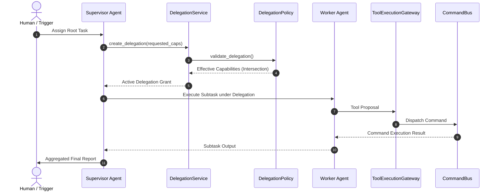

# Multi-Agent Delegation & Supervisor/Worker Architecture

## Overview
Phase 1 Node 7 Part 4 establishes the Multi-Agent Coordination and Delegation Architecture for the AI-Powered Intelligent HRMS platform. It allows Supervisor AI Agents to delegate bounded sub-tasks to specialized Worker AI Agents while maintaining strict tenant boundaries, capability intersection bounds, cryptographic payload integrity, and authoritative routing via `CommandBus`.

## Security Authority & Invariants
1. **Security Authority Invariant**: The LLM is **NEVER** an authorization authority. Every delegated operation flows through the authoritative execution chain:
   $$\text{Supervisor} \rightarrow \text{DelegationService} \rightarrow \text{DelegationPolicy} \rightarrow \text{DelegationGrant} \rightarrow \text{WorkerAgent} \rightarrow \text{AgentExecutionContext} \rightarrow \text{ToolExecutionGateway} \rightarrow \text{AgentCommandGateway} \rightarrow \text{CommandBus} \rightarrow \text{AuthorizationService} \rightarrow \text{PolicyEngine} \rightarrow \text{RiskEngine} \rightarrow \text{HITL} \rightarrow \text{ActionExecutor} \rightarrow \text{UnitOfWork} \rightarrow \text{Outbox} \rightarrow \text{Audit} \rightarrow \text{Result}$$
2. **Capability Subsetting Invariant**: A delegating agent CANNOT grant capabilities it does not possess. The effective worker capability set is strictly bounded by:
   $$\text{worker\_capabilities} = \text{requested\_capabilities} \cap \text{delegator\_capabilities}$$
3. **Privilege Escalation Prevention**: Requesting capabilities broader than the delegator's capabilities triggers an immediate `PrivilegeEscalationError`.
4. **Tenant Isolation**: Cross-tenant delegation requests are strictly rejected (`organization_id` matching).
5. **HITL Governance & Approval**: High-risk or critical capability delegations require human approval. AI Agents are strictly blocked from approving delegation requests.

## Supervisor / Worker Sequence Topology

## Valid & Invalid Delegation Scenarios

### 1. VALID: Capability Subset Delegation
- **Supervisor Capabilities**: `employee:read`, `employee:create`
- **Worker Requested**: `employee:read`
- **Result**: `ALLOW` ($\text{worker\_capabilities} = \{\text{employee:read}\}$)

### 2. INVALID: Privilege Escalation Attempt
- **Supervisor Capabilities**: `employee:read`
- **Worker Requested**: `employee:delete`
- **Result**: `REJECT` (`PrivilegeEscalationError: Delegator does not possess capability for resource 'employee' with actions ['delete']`)

### 3. INVALID: Cross-Tenant Delegation
- **Supervisor Tenant**: `org-acme`
- **Worker Tenant**: `org-stark`
- **Result**: `REJECT` (`DelegationAccessDeniedError: Tenant mismatch`)
