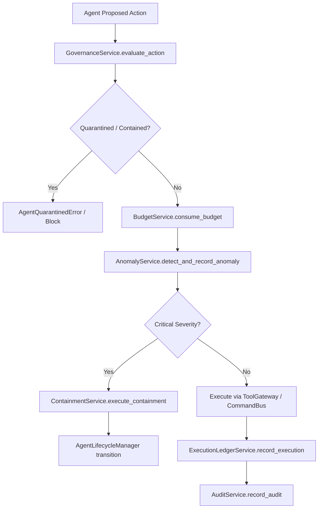

# Agent Governance, Observability, Evaluation & Safety Control Plane Architecture

## Overview
Phase 1 Node 7 Part 6 establishes the enterprise Agent Governance, Observability, Evaluation, and Safety Control Plane framework for the AI-Powered Intelligent HRMS platform. It ensures that autonomous AI agents remain strictly governable, observable, measurable, auditable, and containable without giving the LLM additional authority or permitting self-escalation.

## Core Architectural Separation: Authorization vs. Governance
- **Authorization**: Technical permission evaluation ("Is this actor permitted to execute this command on this resource?").
- **Governance**: Policy, operating bounds, and safety evaluation ("Is this autonomous behavior allowed under the company's safety budget, rate limits, quotas, quarantine state, and anomaly bounds?").

$$\text{Governance is an additional safety check, NOT an authority escalation mechanism.}$$

## Safety Control Plane & Security Invariants
1. **AI Agent Self-Escalation Prohibition**: AI Agents are strictly **PROHIBITED** from:
   - Modifying their own governance policy, state, or quarantine status.
   - Disabling or containing other agents.
   - Resolving their own containment status.
   - Modifying, deleting, or clearing execution ledger, audit trail, or metrics history.
   - Bypassing `CommandBus`, `PolicyEngine`, `RiskEngine`, `Authorization`, or `HITL`.
2. **Immutable Safety Audit Trail**: Every action records an append-only, immutable `AgentAuditRecord` carrying tenant scope, correlation IDs, risk levels, and results. API keys, credentials, and passwords are redacted from metadata automatically.
3. **Emergency Containment Engine**: Executes deterministic lifecycle containment actions (`PAUSE`, `SUSPEND`, `DISABLE`, `TERMINATE`) via `AgentLifecycleManager` when safety bounds or anomaly thresholds are exceeded.
4. **Deterministic Anomaly Detection**: Rule-based detection of suspicious agent behavior (e.g., capability escalation, rapid repeated actions, cross-tenant attempts, policy violations).

## Safety Control Flow

## Quality Gate Verification
- **Pytest**: Passed 100% test suite (264 passed, 2 skipped).
- **Ruff**: Clean (0 errors).
- **Black**: Clean formatting.
- **MyPy**: Clean across all source files.
