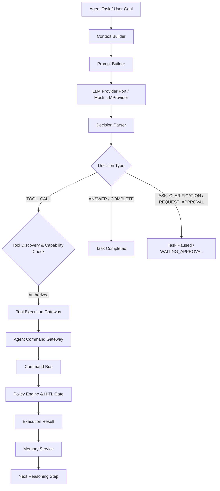

# Agent Intelligence Architecture — Node 7 Part 2

## 1. Executive Summary

Phase 1 — Node 7 Part 2 establishes the intelligence foundation on top of the secure AI Agent Runtime built in Node 7 Part 1. It introduces capability-aware tool discovery, prohibited tool rejection, tenant-isolated memory context building, and a deterministic bounded reasoning engine loop.

Key Security Invariant:
> **The LLM is a reasoning and planning component, NOT an authorization authority.** The LLM cannot grant capabilities, bypass security policies, skip Human-In-The-Loop approvals, modify permissions, or execute direct SQL/Python/shell commands.

---

## 2. Architecture Diagram

---

## 3. Core Components

### 3.1 Tool Registry & Security (`backend/agents/tools/`)
- `ToolDefinition`: Schema defining tool capabilities (`resource`, `action`), category, risk level, and mapped `command_type`.
- `ToolRegistry`: Registry enforcing prohibition of arbitrary query/code execution tools (`sql.execute`, `raw_database_query`, `arbitrary_python`, `shell_execute`, `unrestricted_http`, `filesystem_write`).
- `ToolDiscovery`: Filters tools visible to an agent strictly using `agent.has_capability(tool.resource, tool.action)`.
- `ToolExecutionGateway`: Intercepts `ToolProposal` objects from the reasoning engine and dispatches actions through `AgentCommandGateway` $\rightarrow$ `CommandBus`.

### 3.2 Agent Memory Foundation (`backend/agents/memory/`)
- `AgentMemory`: Tenant-isolated memory entity storing context, observations, tool outcomes, and facts.
- `MemoryService`: Manages tenant-scoped memory persistence and context retrieval.
- `ContextBuilder`: Assembles bounded prompt payloads enforcing character limits (`max_context_chars=4000`) and item limits (`max_memory_items=5`) to prevent context window overflow or credential leakage.

### 3.3 Autonomous Reasoning Engine (`backend/agents/reasoning/`)
- `LLMProviderPort`: Pluggable LLM interface with `MockLLMProvider` for deterministic testing.
- `PromptBuilder`: Sanitizes task goals and agent metadata into system prompts without exposing secret credentials.
- `DecisionParser`: Validates and parses raw LLM JSON outputs into Pydantic `ReasoningDecision` models.
- `ReasoningEngine`: Bounded autonomous loop enforcing `max_steps` (default 10), repeated tool call loop detection, timeout handling, memory recording, and event publishing over `EventBus`.

---

## 4. Security & Compliance Invariants Passed

1. **LLM $\neq$ Security Authority**: All tool execution proposals flow strictly through `ToolExecutionGateway` $\rightarrow$ `AgentCommandGateway` $\rightarrow$ `CommandBus` $\rightarrow$ `AuthorizationService` $\rightarrow$ `PolicyEngine` $\rightarrow$ `RiskEngine` $\rightarrow$ `ApprovalService` (HITL).
2. **Capability Isolation**: Agents can neither discover nor execute tools outside their assigned `AgentCapability` set.
3. **Infinite Loop Protection**: Automated loop detection terminates task execution if the LLM proposes duplicate tool calls with identical arguments.
4. **Tenant Isolation**: Memory context and tool executions are strictly isolated by `organization_id`.
