# Autonomous Agent Orchestration Architecture

## Overview
Phase 1 Node 7 Part 3 implements the production-grade Autonomous Agent Orchestrator, Planning Engine, and Durable Execution Framework for the AI-Powered Intelligent HRMS platform.

## Key Architectural Principles & Invariants
1. **Security Authority Invariant**: The LLM is NEVER an auth authority. It acts strictly as a reasoner, planner, and tool proposer. Every state mutation MUST flow through the strict chain:
   $$\text{Agent} \rightarrow \text{AgentOrchestrator} \rightarrow \text{Plan} \rightarrow \text{PlanValidator} \rightarrow \text{PlanExecutor} \rightarrow \text{ToolExecutionGateway} \rightarrow \text{AgentCommandGateway} \rightarrow \text{CommandBus} \rightarrow \text{AuthorizationService} \rightarrow \text{PolicyEngine} \rightarrow \text{RiskEngine} \rightarrow \text{HITL} \rightarrow \text{ActionExecutor} \rightarrow \text{UnitOfWork} \rightarrow \text{Outbox} \rightarrow \text{Audit} \rightarrow \text{Result}$$
2. **Prohibited Execution Tools**: Direct SQL (`sql.execute`, `raw_database_query`), arbitrary Python (`arbitrary_python`), and shell commands (`shell_execute`) are forbidden and strictly rejected at both `PlanValidator` and `ToolRegistry`.
3. **Replanning Denial Protection**: Security and authorization denials (`CommandBusExecutionError`, `AgentSecurityError`) cannot be bypassed by LLM replanning loops.
4. **HITL Payload Binding**: HIGH and CRITICAL risk steps trigger HITL approval requests bound to exact payload hashes. Self-approval by AI Agents is strictly blocked.
5. **Durable Execution & Recovery**: Pending, executing, or paused agent runs are persisted in PostgreSQL (`agent_plans`, `agent_plan_steps`, `agent_executions`) and recovered seamlessly on application startup without re-executing completed state mutations.

## System Topology

```mermaid
graph TD
    A["AgentOrchestrator"] --> B["PlannerService"]
    A --> C["ExecutionLoop"]
    B --> D["PlanValidator"]
    D -->|"20-Point Security Checks"| E["Plan"]
    C --> F["PlanExecutor"]
    F --> G["ToolExecutionGateway"]
    G --> H["AgentCommandGateway"]
    H --> I["CommandBus"]
    I --> J["Policy / Risk Engine"]
    J --> K["HITL / ActionExecutor"]
```
