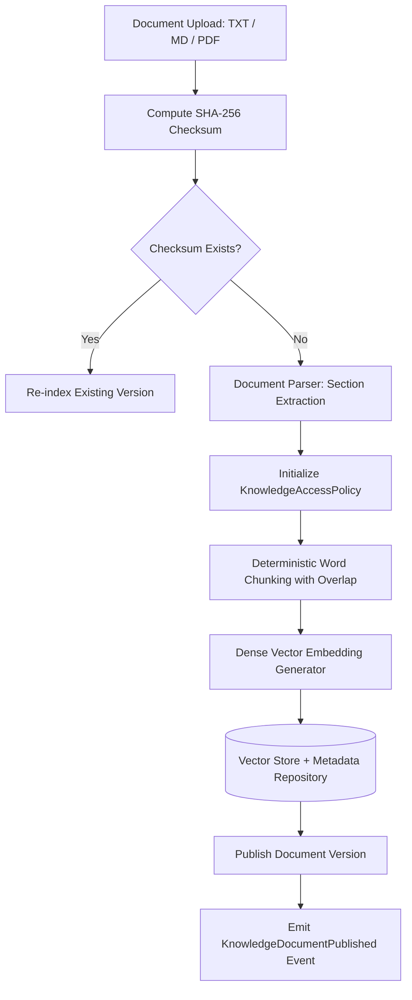

# Knowledge Brain & Authorized RAG Architecture

## 1. Overview & Core Security Invariant

The Knowledge Brain provides secure, tenant-isolated, permission-aware document ingestion, semantic search, and grounded RAG synthesis for all HRMS actors and autonomous AI agents.

### Non-Negotiable Security Invariant
**The LLM is NEVER the authority.**
A vector database must NEVER be queried without pre-retrieval authorization.

```
Actor / Agent
  ↓
Identity & Tenant Verification
  ↓
Pre-Retrieval Authorization (KnowledgeAccessService)
  ↓
Candidate Document Scoping (Tenant + Roles + Scope)
  ↓
Vector Similarity Search (InMemory / Qdrant)
  ↓
Prompt Firewall (Untrusted Data Containment & Sanitization)
  ↓
AI Gateway (Governed Model Routing)
  ↓
LLM
  ↓
Grounded Citation Verification
  ↓
Structured KnowledgeAnswer
```

---

## 2. Ingestion & Indexing Pipeline



---

## 3. Document Classification & Access Scopes

| Scope Type | Target Audience | Example Content |
| :--- | :--- | :--- |
| **`PUBLIC`** | General public / Applicants | Job Descriptions, Career Site Info |
| **`INTERNAL`** | All active employees in tenant | Employee Handbook, Office Holidays |
| **`DEPARTMENT_ONLY`** | Specific departmental staff | Engineering SOPs, Sales Playbooks |
| **`ROLE_BASED`** | Explicit RBAC roles | Recruiter Guide, Payroll Rules |
| **`MANAGER_AND_ABOVE`** | People Managers & Executives | Performance Appraisal Calibration Guide |
| **`HR_ONLY`** | HR Administrators & Recruiters | Severance Calculation Formulas |
| **`EXECUTIVE_ONLY`** | CEO / CHRO / Executives | M&A Strategy, Restructuring Plans |
| **`INDIVIDUAL_EMPLOYEE`** | Single specific employee | Offer Letter, Private Grievance Records |
| **`AGENT_CAPABILITY`** | Authorized Autonomous Agents | Automated Screening Evaluation Metrics |

---

## 4. Citation Verification & Abstention

- **Verifiable Citations**: Every RAG answer generates explicit `CitationReference` records mapped to actual chunk IDs, version numbers, and section titles.
- **First-Class Abstention (`ABSTAIN`)**: If 0 authorized sources are retrieved, or evidence is contradictory/insufficient, the system deterministically outputs an abstention response rather than hallucinating.

---

## 5. Document Lifecycle & Retention Propagation

```
UPLOADED → PROCESSING → INDEXED → PUBLISHED → ARCHIVED / EXPIRED → PURGED
```
- Archiving a document automatically deletes its vector representations from the active index, preventing stale or expired policies from answering current user inquiries.
