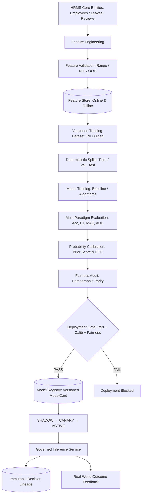

# Predictive ML Platform Architecture

## 1. Core Invariants & Architectural Separation

The Predictive ML Platform provides secure, multi-tenant statistical modeling and HR intelligence across classification, regression, ranking, forecasting, and anomaly detection workloads.

### Primary Architectural Invariant: $\text{ML Prediction} \neq \text{Authority}$
1. A machine learning model prediction is purely an **informational input** to decisions and recommendations.
2. High-impact employment actions (termination, promotion, compensation changes) can **never** be unilaterally triggered by an ML model output.
3. Every state change must flow through:
   ```
   Prediction → Agent/Human → CommandBus → PolicyEngine → RiskEngine → HITL → ActionExecution
   ```

---

## 2. End-to-End Pipeline



---

## 3. Supported Model Types & HR Use Cases

| Model Paradigm | HR Domain Use Case | Input Features | Target Output |
| :--- | :--- | :--- | :--- |
| **`CLASSIFICATION`** | Employee Attrition Risk | Tenure, Leave 90d, Attendance, Engagement | Attrition Probability ($0.0 - 1.0$) |
| **`REGRESSION`** | Performance KPI Projection | Historical reviews, Skill count, Tenure | Projected Rating ($1.0 - 5.0$) |
| **`FORECASTING`** | Workforce Headcount Demand | Department growth, historical attrition | Projected Headcount Horizon |
| **`RANKING`** | Candidate Matching Score | Skill match rate, experience, qualifications | Ordered Candidate Score |
| **`ANOMALY_DETECTION`** | Attendance / Expense Anomalies | Daily punch patterns, travel expense delta | Anomaly Score & Reason |
| **`CLUSTERING`** | Skill Gap Taxonomy | Enterprise skill matrices, job requirements | Departmental Skill Clusters |

---

## 4. Deterministic Abstention (`ABSTAIN`)

Every inference pipeline explicitly evaluates reliability bounds before generating a prediction:
1. **`INSUFFICIENT_DATA`**: Missing required features or high null rates.
2. **`OUT_OF_DISTRIBUTION`**: Input feature values severely violate training dataset minimum/maximum bounds.
3. **`ABSTAIN`**: Prediction confidence is below the model's configured `abstain_confidence_threshold`.
4. **`POLICY_BLOCKED`**: Model is currently in `RESTRICTED` or `DEVELOPMENT` stage without an active production release.
